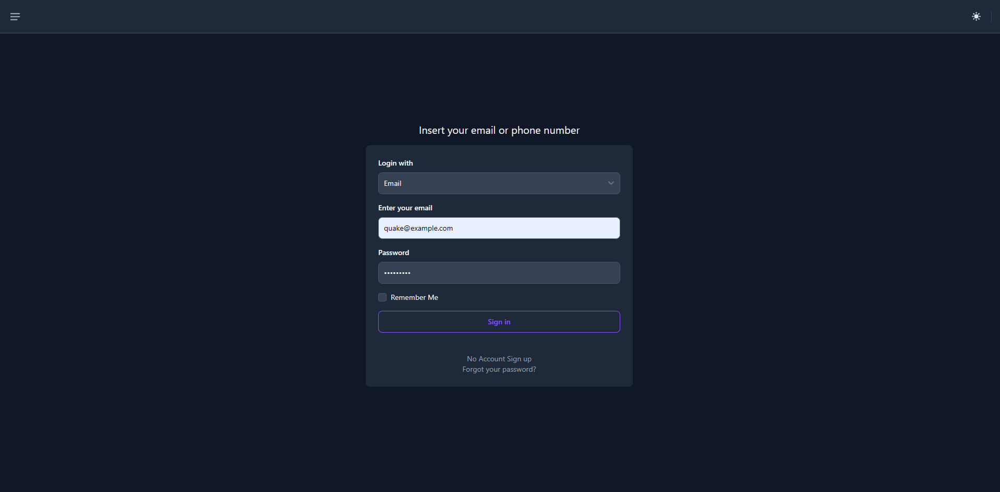
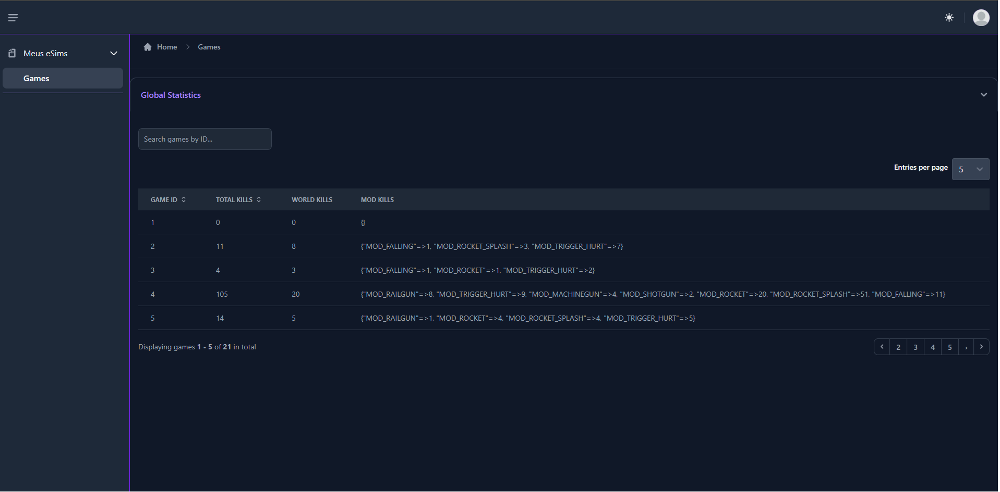
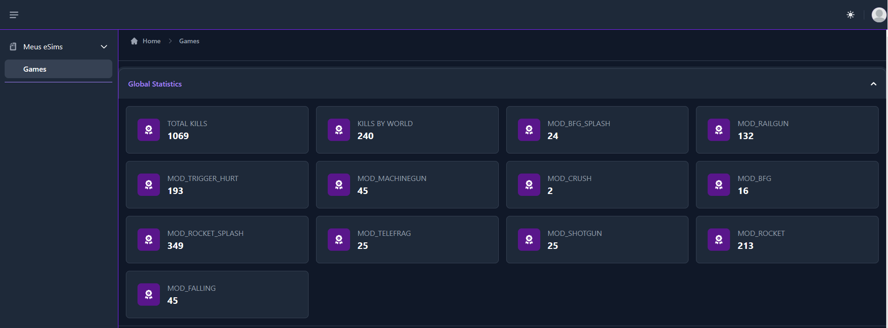

#### Prints ####

Tela de login
[](https://github.com/sergiohc/quake/blob/main/.github/docs/sign.png?raw=true)

Tabela com estatísticas por partida
[](https://github.com/sergiohc/quake/blob/main/.github/docs/home.png?raw=true)

Estatísticas gerais somando todos os jogos
[](https://github.com/sergiohc/quake/blob/main/.github/docs/globalstats.png?raw=true)

## História 1 - Backend

Eu como administrador do jogo, quero ter a estatística por jogo, do total de mortes, de mortes por causa e de mortes causadas pelo `<world>` para entender dificuldade dos jogadores.

Motivo da escolha: Não queria demorar pra fazer o teste pois no momento tenho outro teste para fazer, então não seria tão simples quanto a Api e levaria menos tempo que a historia 2

#### Clone este repositório em qualquer lugar que desejar:

```sh
git clone git@github.com:sergiohc/quake.git
cd quake
```

#### Copie o arquivo .env de exemplo:

```sh
cp .env.example .env
```

## Configuração do Projeto

1. Construa e inicie os serviços do Docker:

```bash
docker compose up --build
```

2. Em outro terminal, execute o seguinte comando para configurar o banco de dados:

```bash
./run rails db:setup
```

3. Acesse a aplicação em seu navegador:

```
http://localhost:8000/
```

Login:
  email: quake@example.com
  password: 123123123
